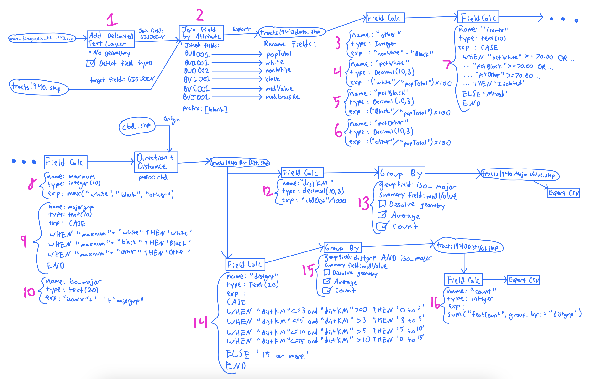
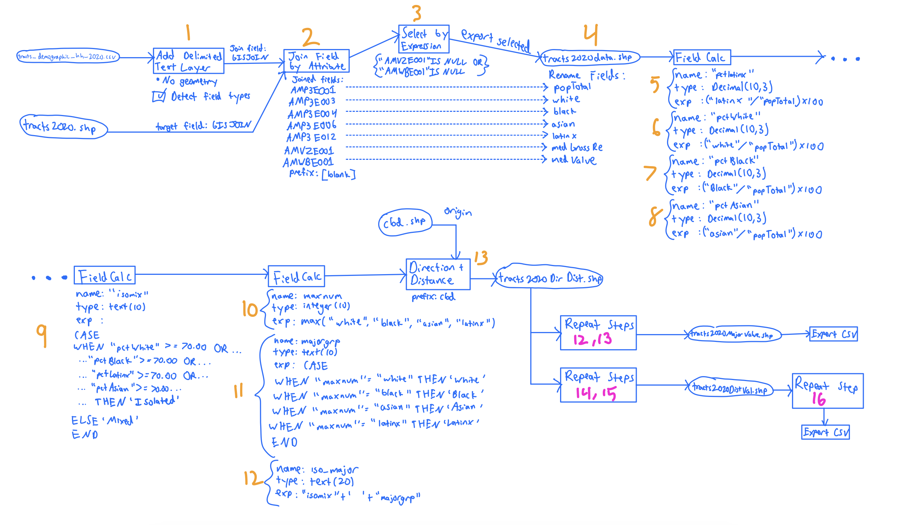

```{r}
library(tidyverse)
library(gt)

dist1940 <- read.csv(file="Problem1/1940DistVal.csv", header=T)
dist2020 <- read.csv(file="Problem1/2020DistVal.csv", header=T)
median1940 <- read.csv(file="Problem1/1940MajorValue.csv", header=T)
median2020 <- read.csv(file="Problem1/2020MajorValue.csv", header=T)


median1940 <- median1940 %>%
  mutate(avgmedValu = round(avgmedValu, 2)) %>% #round off the home values to two digits
  select(-cntmedValu) %>%                       #get rid of the duplicate feature count column
  select(iso_major, featCount, avgmedValu)      #re-order the race classes to the front

median2020 <- median2020 %>%
  mutate(avgmedValu = round(avgmedValu, 2)) %>%
  select(-cntmedValu) %>%
  select(iso_major, featCount, avgmedValu)

median_table <- left_join(median1940, median2020, by = "iso_major") #join the two smaller tables above into one large table

dist1940 <- dist1940 %>%
  mutate(avgmedValu = round(avgmedValu, 2)) %>%    #round off the home values to two digits
  select(-c(cntmedValu, featCount)) %>%            #get rid of the duplicate columns
  pivot_wider(
    names_from = iso_major,                        #pivot wider, make isolated groups into columns
    values_from = avgmedValu,                      #translate the median home values
  ) %>%
  arrange(by=as.integer(substr(distgrp, 1, 2)))    #take the first two numbers from distance groups as integers and arrange in numerical order


dist2020 <- dist2020 %>%
  mutate(avgmedValu = round(avgmedValu, 2)) %>%
  select(-c(cntmedValu, featCount)) %>%
  pivot_wider(
    names_from = iso_major, 
    values_from = avgmedValu,
  ) %>%
  arrange(by=as.integer(substr(distgrp, 1, 2)))
```

```{r}

gt_median <- gt(median_table) %>%
  tab_header(title = "Average of median home value for owner-occupied houses in St. Louis, MO in 1940 and 2020") %>%
  cols_label(
    iso_major = "Majority Group",
    featCount.x = "Feature Count (1940)",
    avgmedValu.x = "Average Median Home Value (1940)", 
    featCount.y = "Feature Count (2020)", 
    avgmedValu.y = "Average Median Home Value (2020)"
  ) %>%
  cols_align(align = "center", columns = everything()) %>%     #center align columns
  fmt_currency(
    columns = c(avgmedValu.x, avgmedValu.y),
    currency = "USD"
  )

gt_dist1940 <- gt(dist1940) %>%
  tab_header(title = "Average of median home value for owner-occupied houses in St. Louis, MO in 1940") %>%
  cols_label(
    distgrp = "Distance from CBD (km)",
    count = "Feature Count",
  ) %>%
  cols_align(align = "center", columns = everything())%>%
  fmt_currency(
    columns = c(3:6),
    currency = "USD"
  ) %>%
  cols_move(
    columns = 6,
    after = 4
  )

gt_dist2020 <- gt(dist2020) %>%
  tab_header(title = "Average of median home value for owner-occupied houses in St. Louis, MO in 2020") %>%
  cols_label(
    distgrp = "Distance from CBD (km)",
    count = "Feature Count",
  ) %>%
  cols_align(align = "center", columns = everything())%>%
  fmt_currency(
    columns = c(3:6),
    currency = "USD"
  ) %>%
  cols_move(
    columns = 6,
    after = 4
  )

gt_median
gt_dist1940
gt_dist2020
```